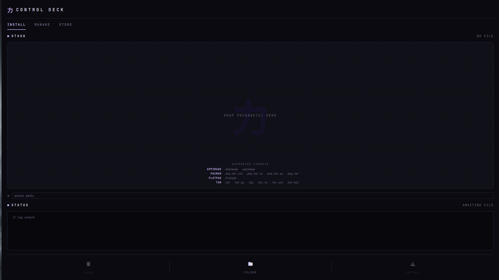
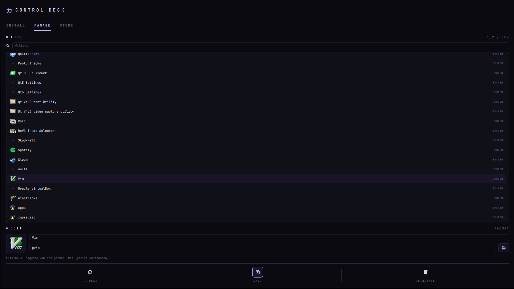
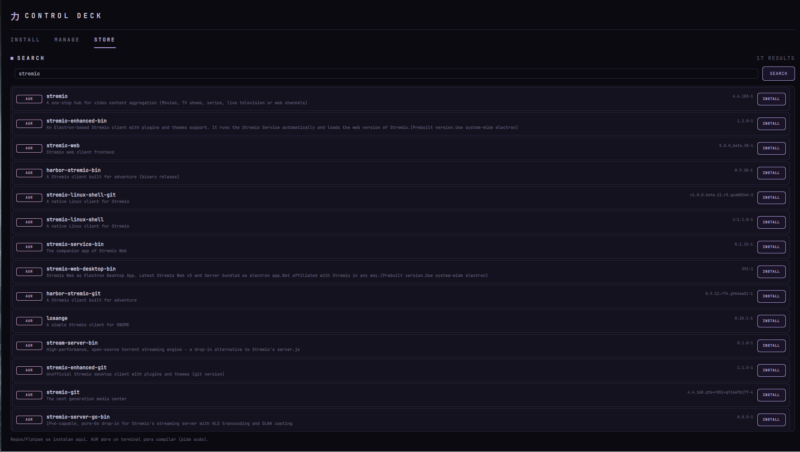

# 力 Install Deck

**Instalador y gestor universal de aplicaciones de un clic para Arch / CachyOS**, con interfaz [QuickShell](https://quickshell.outfoxxed.me/) (Wayland / Hyprland) y estética *CONTROL DECK*.

Arrastra un paquete y se instala solo, gestiona/edita/desinstala las apps de tu menú, y busca e instala software por nombre desde los repos, AUR y Flatpak — todo desde una misma ventana.

> Inspirado en el [post de r/unixporn](https://www.reddit.com/r/unixporn/comments/1ugobnt/oc_install_any_app_with_just_one_click/) *"install any app with just one click"*.

---

## ✨ Características

La ventana tiene tres pestañas:

### 📥 INSTALL — instalar desde archivo
- **Arrastra y suelta** uno o varios paquetes (cola multi‑archivo) y pulsa **INSTALL ALL**.
- Detecta el formato automáticamente y actúa según corresponda:

| Formato | Qué hace |
|---|---|
| `.AppImage` `.appimage` | Copia a `~/Applications`, lo hace ejecutable y crea un lanzador con su icono |
| `.pkg.tar.zst` `.pkg.tar.xz` `.pkg.tar.gz` `.pkg.tar` | `pacman -U` (vía `pkexec`) |
| `.flatpak` | `flatpak install --user` |
| `.tar` `.tar.gz` `.tgz` `.tar.xz` `.tar.zst` `.tar.bz2` | Extrae a `~/Applications/<nombre>` |

> `.deb` y `.rpm` se detectan pero **solo avisan** (no son nativos de Arch).

### 🗂️ MANAGE — gestionar apps instaladas
- **Listado** de todas las apps de tu menú (con icono, buscador y origen).
- **Editar nombre e icono** de cualquier app. El icono se **copia a un directorio gestionado**, así que sigue funcionando aunque borres el archivo original.
- **Desinstalar** de forma segura según el origen:
  - **Flatpak** → `flatpak uninstall`
  - **AppImage** → borra el AppImage + icono + lanzador
  - **Paquete pacman** → `pacman -Rns` (con **previsualización** de lo que se eliminaría)
  - **Wine / DOSBox** → quita el acceso directo del menú
  - **Accesos de Steam / Lutris / Heroic** → solo quitan el acceso directo, **nunca** el cliente

### 🛒 STORE — instalar por nombre
- Busca en **repos oficiales (pacman)**, **AUR** y **Flatpak** a la vez.
- Resultados unificados con badge de origen, versión y descripción.
- Instala con un clic:
  - **Repos** → `pkexec pacman -S`
  - **Flatpak** → `flatpak install --user`
  - **AUR** → abre un terminal con `paru`/`yay` para el build interactivo

---

## 📸 Capturas

| INSTALL | MANAGE | STORE |
|---|---|---|
|  |  |  |

---

## 🧩 Requisitos

**Imprescindibles:**
- [`quickshell`](https://quickshell.outfoxxed.me/) `>= 0.3`
- `bash`, `coreutils`, `jq`, `libarchive` (`bsdtar`), `pacman`
- `polkit` + un agente gráfico (p. ej. `hyprpolkitagent`) — para el `pkexec` de pacman
- Una **Nerd Font** (el proyecto usa *JetBrainsMono Nerd Font* para los iconos)

**Opcionales (según lo que uses):**
- `flatpak` con el remoto `flathub` — para instalar/buscar Flatpaks
- `libnotify` (`notify-send`) — notificaciones al terminar
- `curl` — búsqueda en el AUR
- `paru` o `yay` + un terminal (`kitty`, `alacritty`…) — para instalar del AUR
- `zenity` — selector gráfico de iconos en MANAGE

---

## 🚀 Instalación

```bash
git clone https://github.com/madkyp/app_install.git
cd app_install
./install.sh
```

Esto copia:
- `bin/install-any` → `~/.local/bin/install-any` (lógica en bash)
- `quickshell/shell.qml` → `~/.config/quickshell/install-any/shell.qml` (GUI)
- `install-any.desktop` → `~/.local/share/applications/` (lanzador)

Asegúrate de tener `~/.local/bin` en tu `PATH`.

### Desinstalar
```bash
./uninstall.sh
```

---

## 🖱️ Uso

- Desde tu lanzador de aplicaciones: **"Install Any"**.
- Desde terminal: `qs -c install-any`
- También funciona en modo CLI: `install-any install <archivo>`, `install-any search <nombre>`, etc.

### Atajo de Hyprland (opcional)
Añade a tu `~/.config/hypr/keybindings.conf` (o `hyprland.conf`):

```ini
bind = SUPER SHIFT, I, exec, pkill -xf "qs -c install-any" || qs -c install-any
```

Abre/cierra el deck con **SUPER + SHIFT + I**.

---

## 🏗️ Cómo funciona

Arquitectura **script backend + GUI fina**:

- **`bin/install-any`** — un script bash con toda la lógica (detección de formato, instalación, listado/edición/desinstalación de `.desktop`, búsqueda). Es totalmente usable sin GUI. Subcomandos: `detect`, `install`, `installmany`, `detectmany`, `list`, `appinfo`, `edit`, `uninstall`, `rmpreview`, `search`, `installpkg`, `pickfile`.
- **`quickshell/shell.qml`** — la interfaz, que solo muestra estado y llama al backend vía `Process`.

Esto hace fácil depurar y reutilizar la lógica desde consola.

---

## ⚠️ Notas de seguridad

- Los accesos directos de juegos (`steam://`, `lutris:`, `heroic://`) se tratan como lanzador de usuario: **desinstalarlos solo quita el acceso directo del menú**, no borra el cliente ni los datos del juego.
- Antes de un `pacman -Rns` se muestra **qué paquetes se eliminarían**.
- Las entradas del sistema sin paquete asociado no se desinstalan (por seguridad).

---

## 📄 Licencia

MIT — ver [LICENSE](LICENSE).
